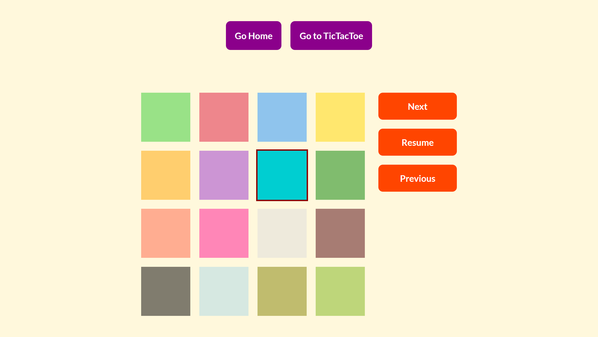
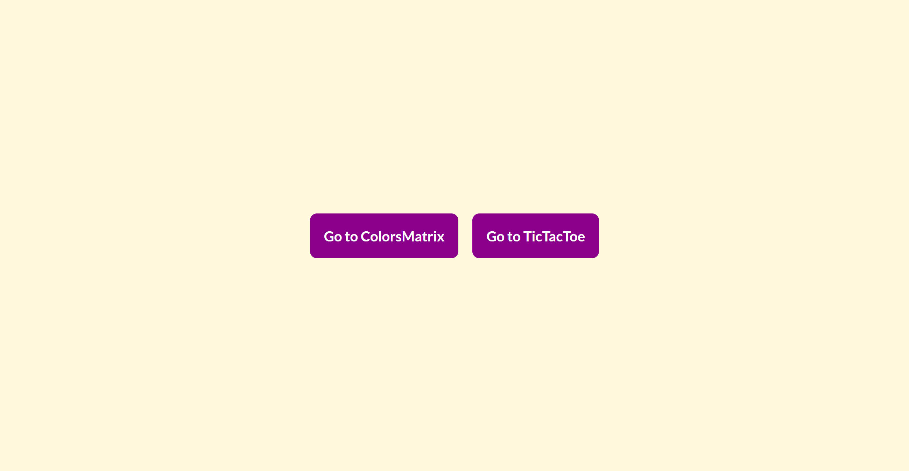
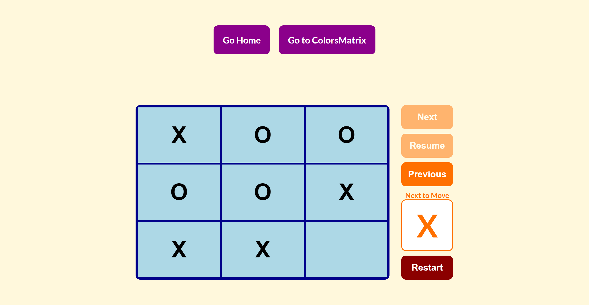
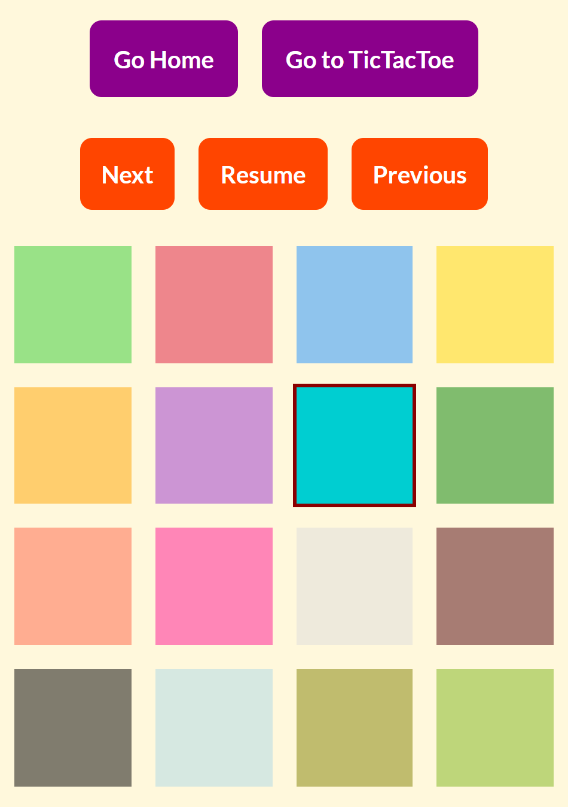
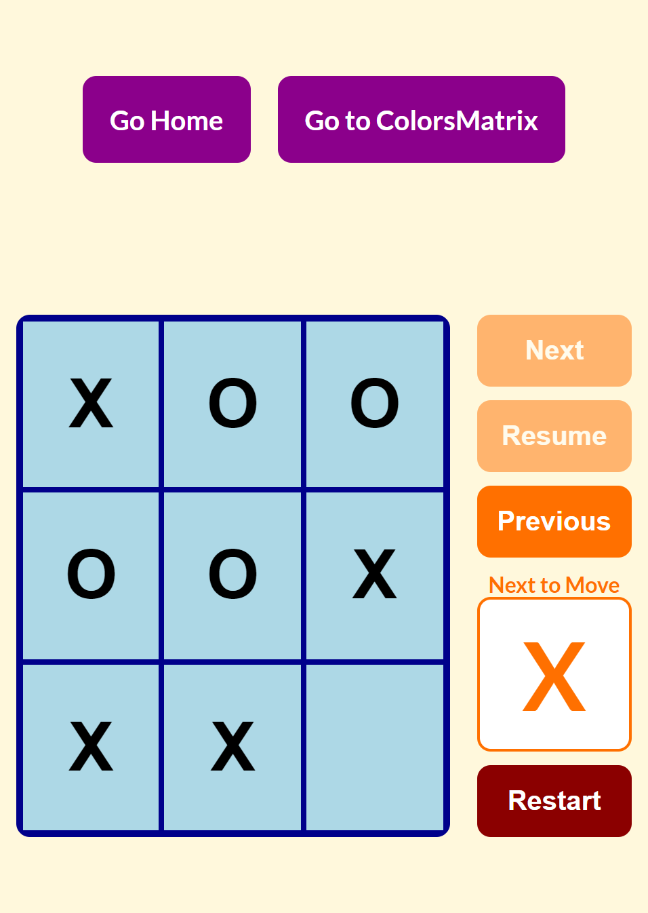

# Tic-Tac-Toe & Matrix of Colors

## Description

The project consist of two phases:

The first phase is about building a custom hook that can keep track of state changes and use it to create a matrix of colored squares which can be individually selected by the user and the order in which the user picked the colors is remembered in order for the user to be able to go backwards and forwards in time with their selected colors.

The second phase is about building a tic-tac-toe board game which allows move travelling and replaying the game when a winner is determined.

## Live Site

[Vercel Deployment](https://homework-week-7.vercel.app/)

## Built With

- Semantic HTML5 markup
- CSS Flexbox
- CSS Grid
- Media Querys
- Desktop-First approach
- Sass / Scss
- React JS Basics
- React Router Basics
- React Hooks / Custom Hooks
- react-confetti package

## Visuals

**Screenshots Desktop #1**

**Screenshots Desktop #2**

**Screenshots Desktop #3**

**Screenshots Desktop #4**

**Screenshots Mobile #1**

**Screenshots Mobile #2**

